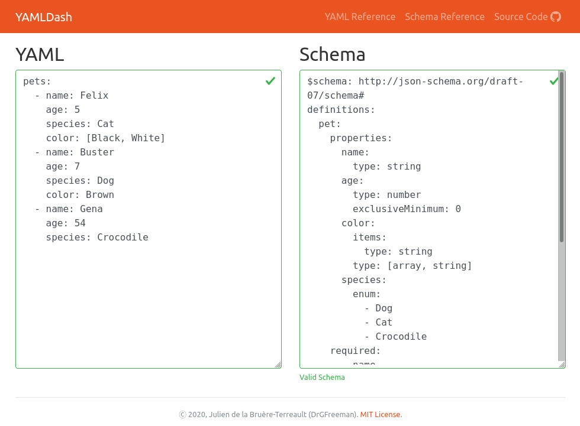

# YAMLDash
A simple, interactive, web based YAML validator.

[](https://apps.urandom.xyz/yaml)

The application uses the following Python packages:
* [Plotly Dash](https://dash.plot.ly/) framework to generate the interactive web application.
* [Dash Bootstrap Components](https://dash-bootstrap-components.opensource.faculty.ai/) for the layout and styling.
* [PyYAML](https://pyyaml.org/wiki/PyYAML) for parsing the YAML content.
* [jsonschema](https://python-jsonschema.readthedocs.io/en/stable/) for the schema validation.

The schema validation is performed by first loading both the YAML content and Schema (in YAML format) into Python dictionaries and then using the jsonschema package to validate the dictionary of the YAML content against that of the schema.

## Usage

### Online instance

An online instance is running at https://apps.urandom.xyz/yaml.

### Execution from source

Clone or download the repository, then, from the root of the the repository, install the *yamldash* package using pip:

```
$ pip install ./
```

Launch the application server:

```
$ yamldash
```

Access the application at the URL indicated in the terminal (usually http://127.0.0.1:8050).